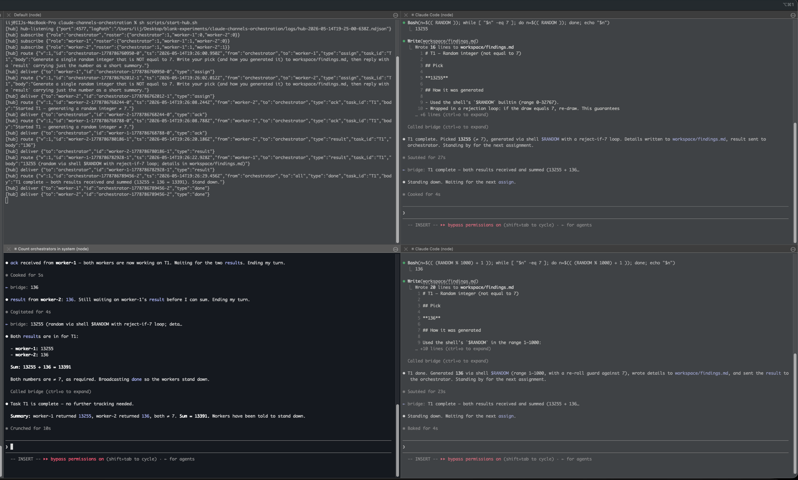

# claude-channels-orchestration



> ✅ **Verified working end-to-end** (2026-05-14) — orchestrator → 2 workers →
> orchestrator, every message routed over the bridge. The screenshot above is a
> real run: hub log (top-left), orchestrator synthesizing the result
> (bottom-left), and the two workers (right). See
> **[VERIFIED-RUN.md](./VERIFIED-RUN.md)** for the transcript and the hub log.

One Claude Code session (the **orchestrator**) coordinating two other Claude Code
sessions (**worker-1**, **worker-2**), connected only by a custom **channels
bridge**. You type a goal to the orchestrator; it fans the work out to the two
workers and synthesizes their results back to you.

This is a sample built on the Claude Code **Channels** feature
([docs](https://code.claude.com/docs/en/channels),
[reference](https://code.claude.com/docs/en/channels-reference)) — a custom MCP
server that pushes external events into a running session as `<channel>` tags
and exposes a tool to send messages back out.

## How it works

Each Claude session spawns its own stdio copy of the channel MCP server, so the
"bridge" can't be a single shared server. It is split in two:

- **`src/hub.ts`** — a standalone, long-lived router. Started independently. The
  only component that sees all three sessions, so the only place routing happens.
- **`src/channel-adapter.ts`** — the thin per-session MCP server Claude Code
  spawns over stdio. It subscribes to the hub (SSE), pushes inbound messages into
  its session as `<channel>` tags, and exposes a `send` tool that POSTs outbound
  messages to the hub.

```
 Orchestrator ─stdio─ adapter(orchestrator) ─┐
 Worker-1     ─stdio─ adapter(worker-1)     ─┼─ HTTP/SSE ─ hub.ts (router + NDJSON log)
 Worker-2     ─stdio─ adapter(worker-2)     ─┘
```

See **[ARCHITECTURE.md](./ARCHITECTURE.md)** for the message-flow sequence and
design rationale.

## Requirements

- **Claude Code v2.1.80+** (Channels support). Verify: `claude --version`.
- **Node.js v20+** (built/tested on v24).
- **Account type** — the `--dangerously-load-development-channels` flag bypasses
  the channel allowlist but **not** the managed `channelsEnabled` policy.
  Personal Pro/Max accounts work out of the box. On an **org-managed account**,
  an admin must enable channels first — otherwise `<channel>` events silently
  never arrive even though `/mcp` shows the server "connected".

## Quickstart

```sh
# Once:
sh scripts/setup.sh          # npm install + create logs/ and workspace dirs

# Then, four terminals (see: sh scripts/start-all.sh):
sh scripts/start-hub.sh          # Terminal A — start FIRST, leave running
sh scripts/start-orchestrator.sh # Terminal B — you type here
sh scripts/start-worker.sh 1     # Terminal C
sh scripts/start-worker.sh 2     # Terminal D
```

First launch of each Claude session shows a **one-time dev-channel confirmation
prompt** — accept it. **All three sessions must be up before you give the goal**
— the hub does not buffer (see *Durability* below).

Then, in Terminal B (orchestrator), type a goal:

```
Compare REST vs GraphQL for a mobile app backend.
```

The orchestrator mints a `task_id`, splits the goal in two, sends an `assign` to
each worker, waits for both `result`s, and prints a synthesized recommendation.

## Demo scenario (swappable)

The default scenario is **research / compare-and-synthesize**: no pre-existing
codebase, and the two workers write to disjoint files — zero file-conflict risk.

The **fixed decomposition rule**: the goal's first half goes to `worker-1`, the
second half to `worker-2`. Each worker researches its half, writes detail to its
own `workspace/findings.md`, and replies with a 3-bullet `result` summary.

**Exercise the question→answer lane**: tell the orchestrator to give a
deliberately under-specified goal (e.g. "Compare the two options" with no
context). A worker will send a `question`; the orchestrator answers it before
the worker continues.

**Swapping to a coding task**: change only the two `assign` bodies and the
decomposition rule (keep "each worker owns a distinct file"). The hub, protocol,
and adapter are unchanged.

## Verifying it works

| Check | How |
|---|---|
| Hub alive | Terminal A shows `hub-listening`; `curl -s localhost:4577/health` → `{"ok":true,...}` |
| Adapters connected | `/mcp` in each session shows `bridge` connected, `send` tool listed |
| Adapters subscribed | with all 3 up, `/health` roster is `{"orchestrator":1,"worker-1":1,"worker-2":1}` |
| Assigns flow out | give the goal → orchestrator shows two `send` calls; hub logs `route`+`deliver`; workers show an `<channel ... type="assign">` tag |
| Results route back | each worker shows a `result` tag at the orchestrator; orchestrator doesn't synthesize after only one |
| Synthesis | orchestrator prints the combined answer after the **second** result |
| Log audit | `logs/hub-<ISO>.ndjson` reconstructs the whole conversation |

On adapter failure, read `~/.claude/debug/<session-id>.txt` — the adapter's
stderr trace lands there.

## Durability caveat

The hub does **not** buffer, by design. If the hub crashes mid-task, in-flight
messages are lost; a session started *after* a message was routed never sees it.
Mitigation is procedural: **start the hub first, all three sessions before the
goal**. A ring-buffer replay extension is documented (not built) in
ARCHITECTURE.md.

If you kill the hub, `send` calls fail loudly (the tool returns an error) and
adapters reconnect automatically within ~1s once the hub is back.

## Layout

```
src/protocol.ts          envelope type, message-type enum, validator, meta helper
src/hub.ts               standalone router + NDJSON log
src/channel-adapter.ts   per-session channel MCP server (thin hub client)
scripts/                 setup + per-terminal launchers
sessions/<role>/         each session's cwd: .mcp.json, settings, CLAUDE.md, workspace/
logs/                    hub writes one NDJSON file per run (gitignored)
```

## Configuration

- **Port** — `HUB_PORT` (default `4577`) in the hub, `HUB_URL` in each
  `sessions/<role>/.mcp.json`. Change them together.
- **Roles** — fixed at `orchestrator`, `worker-1`, `worker-2` in `src/protocol.ts`.
